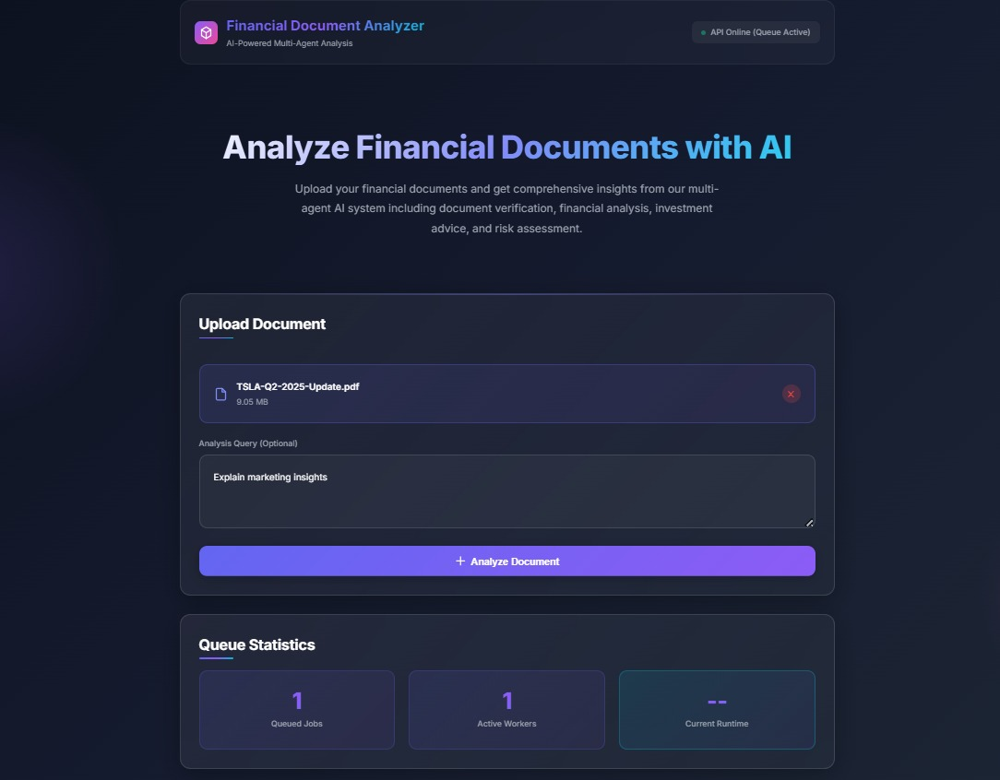

# Financial Document Analyzer

> AI-powered financial document analysis system with asynchronous queue-based processing using CrewAI multi-agent architecture.

## 📋 Overview

The **Financial Document Analyzer** is a FastAPI application that uses multiple AI agents to analyze financial documents (PDFs) and provide comprehensive investment insights, risk assessments, and market analysis. The system leverages Redis Queue (RQ) for asynchronous job processing and MongoDB Atlas for persistent job tracking and result storage.

### Key Features

- **Multi-Agent AI Analysis**: Four specialized AI agents working sequentially:
  - Document Verifier (validates financial documents)
  - Financial Analyst (extracts metrics and analyzes trends)
  - Investment Advisor (provides investment recommendations)
  - Risk Assessor (evaluates financial risks)

- **Asynchronous Processing**: Redis Queue-based job system for non-blocking document analysis
- **Persistent Storage**: MongoDB Atlas integration for job tracking and result persistence
- **Real-time Job Tracking**: Monitor analysis progress with job status endpoints
- **RESTful API**: Clean FastAPI endpoints with automatic OpenAPI documentation
- **Scalable Architecture**: Horizontal scaling with multiple workers
- **Modern Frontend**: Interactive web interface with real-time updates

---

## 🏗️ Architecture

### System Components

```
┌─────────────┐      ┌──────────────┐      ┌─────────────┐
│   Frontend  │─────▶│   FastAPI    │─────▶│    Redis    │
│ (HTML/JS/CSS│      │   (main.py)  │      │    Queue    │
└─────────────┘      └──────────────┘      └─────────────┘
                            │                      │
                            │                      ▼
                            ▼              ┌─────────────┐
                     ┌─────────────┐       │   Worker    │
                     │   MongoDB   │       │ (worker.py) │
                     │   Atlas     │       └─────────────┘
                     └─────────────┘              │
                            │                      ▼
                            └──────────────────────┘
                                     │
                                     ▼
                      ┌──────────────────────────────┐
                      │   CrewAI Multi-Agent System  │
                      │  (4 Agents + 4 Tasks)        │
                      └──────────────────────────────┘
```

**Data Flow:**
1. User uploads PDF through frontend
2. FastAPI creates job record in MongoDB
3. Job is enqueued to Redis Queue
4. Worker processes job using CrewAI agents
5. Results stored in MongoDB and Redis
6. Frontend polls for updates and displays results

---

## 📁 File Structure

```
finance-debugging/
├── main.py                 # FastAPI application & API endpoints
├── agents.py               # AI agent definitions (4 specialized agents)
├── task.py                 # Task definitions for CrewAI agents
├── tools.py                # Custom tools (PDF reader, analyzers)
├── jobs.py                 # Background job execution functions
├── worker.py               # RQ background worker process
│
├── redis_config.py         # Redis Queue configuration
├── queue_manager.py        # Redis Queue management & operations
│
├── mongo_config.py         # MongoDB Atlas configuration
├── mongo_manager.py        # MongoDB operations & job tracking
├── test_mongodb.py         # MongoDB connection tests
│
├── requirements.txt        # Python dependencies
├── .env                    # Environment variables (API keys)
├── .gitignore             # Git ignore rules
│
├── static/                 # Frontend files
│   ├── index.html         # Main web interface
│   ├── app.js             # Frontend JavaScript logic
│   └── styles.css         # UI styling
│
├── data/                   # Temporary uploaded PDF storage
└── outputs/                # Analysis results storage
```

---

## 🛠️ Tech Stack

### Backend
- **Web Framework**: FastAPI 0.110.3
- **AI Framework**: CrewAI 0.130.0
- **LLM Integration**: Google Gemini (via langchain-google-genai 1.0.3)
- **Queue System**: Redis + RQ (Redis Queue 1.15.1)
- **Database**: MongoDB Atlas (pymongo 4.6.0+)
- **ASGI Server**: Uvicorn

### AI & NLP
- **Multi-Agent System**: CrewAI with 4 specialized agents
- **Language Model**: Google Gemini Pro
- **Web Search**: Serper API integration
- **Document Processing**: LangChain PDF loaders

### Frontend
- **HTML5/CSS3**: Modern responsive design
- **JavaScript**: Vanilla JS with async/await
- **UI Features**: Real-time polling, file upload, status tracking

### Infrastructure
- **In-Memory Cache**: Redis 5.0+
- **Database**: MongoDB Atlas (Cloud)
- **Storage**: Local file system for temporary PDFs

---

## 🚀 Installation

### Prerequisites

- Python 3.11 or higher
- Redis 6.0 or higher (running locally or remote)
- MongoDB Atlas account (free tier available)
- Google Gemini API Key
- Serper API Key

### Step-by-Step Setup

```bash
# 1. Clone the repository
git clone <repository-url>
cd finance-debugging

# 2. Install Python dependencies
pip install -r requirements.txt

# 3. Set up environment variables
# Create a .env file in the root directory with:
GOOGLE_API_KEY=your_google_gemini_api_key_here
SERPER_API_KEY=your_serper_api_key_here
MONGODB_URI=your_mongodb_atlas_connection_string
CREWAI_TRACING_ENABLED=false

# 4. Start Redis server
# On Linux/macOS:
redis-server

# On Windows (if using WSL):
sudo service redis-server start

# Or use Docker:
docker run -d -p 6379:6379 redis:latest

# 5. Start the FastAPI server
python main.py
# Server runs on http://localhost:8000

# 6. In a separate terminal, start the RQ worker
python worker.py
# Worker will process jobs from the queue

# 7. Access the application
# Open browser and navigate to: http://localhost:8000/static/index.html
```

### Getting API Keys

**Google Gemini API Key:**
1. Visit https://makersuite.google.com/app/apikey
2. Create a new API key
3. Copy the key to your `.env` file

**Serper API Key:**
1. Visit https://serper.dev/
2. Sign up for a free account
3. Get your API key from the dashboard
4. Copy the key to your `.env` file

**MongoDB Atlas:**
1. Visit https://www.mongodb.com/cloud/atlas
2. Create a free cluster
3. Get your connection string
4. Replace `<password>` and database name in the URI

---

## 📡 API Documentation

### Base URL
```
http://localhost:8000
```

### Endpoints

#### 1. Health Check
**GET** `/`

Check if the API is running and view service status.

**Response:**
```json
{
  "message": "Financial Document Analyzer API is running",
  "version": "2.0.0",
  "queue_enabled": true,
  "mongodb_enabled": true,
  "features": [
    "async_processing",
    "job_tracking",
    "multi_agent_analysis",
    "persistent_storage"
  ]
}
```

---

#### 2. Submit Analysis Job
**POST** `/analyze`

Upload a PDF document for analysis.

**Request:**
- Content-Type: `multipart/form-data`
- Parameters:
  - `file` (required): PDF file to analyze
  - `query` (optional): Custom analysis query (default: "Analyze this financial document for investment insights")

---

#### 3. Get Job Status
**GET** `/job/{job_id}/status`

Check the current status of an analysis job.

**Parameters:**
- `job_id` (path): Unique job identifier

**Example:**
```bash
curl http://localhost:8000/job/8a558318-87aa-46c0-a44a-04872dda04c1/status
```

**Response (Queued):**
```json
{
  "job_id": "8a558318-87aa-46c0-a44a-04872dda04c1",
  "status": "queued",
  "created_at": "2026-02-08T19:30:00Z",
  "message": "Job is waiting in queue"
}
```

**Response (Processing):**
```json
{
  "job_id": "8a558318-87aa-46c0-a44a-04872dda04c1",
  "status": "processing",
  "created_at": "2026-02-08T19:30:00Z",
  "started_at": "2026-02-08T19:30:15Z",
  "message": "Job is being processed"
}
```

**Response (Finished):**
```json
{
  "job_id": "8a558318-87aa-46c0-a44a-04872dda04c1",
  "status": "finished",
  "created_at": "2026-02-08T19:30:00Z",
  "started_at": "2026-02-08T19:30:15Z",
  "completed_at": "2026-02-08T19:32:45Z",
  "message": "Job completed successfully"
}
```

**Status Values:**
- `queued` - Job waiting in queue
- `started` - Job picked up by worker
- `processing` - CrewAI agents analyzing document
- `finished` - Analysis completed successfully
- `failed` - Job encountered an error

---

#### 4. Get Job Result
**GET** `/job/{job_id}/result`

Retrieve the analysis results for a completed job.

**Parameters:**
- `job_id` (path): Unique job identifier

**Example:**
```bash
curl http://localhost:8000/job/8a558318-87aa-46c0-a44a-04872dda04c1/result
```

**Response (Success):**
```json
{
  "job_id": "8a558318-87aa-46c0-a44a-04872dda04c1",
  "status": "success",
  "query": "What are the key investment opportunities?",
  "analysis": "# Financial Analysis Report\n\n## Document Verification\n...\n\n## Financial Analysis\n...",
  "message": "Financial analysis completed successfully"
}
```

#### 5. Queue Statistics
**GET** `/queue/stats`

Get current queue statistics and worker information.

**Example:**
```bash
curl http://localhost:8000/queue/stats
```

**Response:**
```json
{
  "queued_jobs": 3,
  "active_jobs": 1,
  "finished_jobs": 25,
  "failed_jobs": 2,
  "workers": 1,
  "queue_name": "financial_analysis"
}
```


## 🔌 Redis and MongoDB Integration

### Redis Queue System

**Purpose**: Asynchronous job processing and temporary result storage

**Configuration** (`redis_config.py`):
```python
REDIS_HOST = "localhost"
REDIS_PORT = 6379
REDIS_DB = 0
QUEUE_NAME = "financial_analysis"
JOB_TIMEOUT = 300  # 5 minutes
RESULT_TTL = 86400  # 24 hours
MAX_RETRIES = 3
```

**Key Features:**
- Non-blocking document processing
- Job queuing with priority support
- Automatic retry on failure (max 3 attempts)
- Worker health monitoring
- Result caching (24-hour TTL)

**Queue Operations:**
- `enqueue_job()` - Add job to queue
- `get_job_status()` - Check job state
- `get_job_result()` - Retrieve from Redis cache
- `cancel_job()` - Remove from queue
- `get_queue_stats()` - Monitor queue health

---

### MongoDB Atlas Integration

**Purpose**: Persistent job tracking, result storage, and analytics

**Configuration** (`mongo_config.py`):
```python
MONGODB_URI = "mongodb+srv://..."
DATABASE_NAME = "financial_analysis"
JOBS_COLLECTION = "jobs"
CONNECT_TIMEOUT = 5000
SERVER_SELECTION_TIMEOUT = 5000
```

**Data Schema:**

**Job Document:**
```json
{
  "_id": "8a558318-87aa-46c0-a44a-04872dda04c1",
  "job_id": "8a558318-87aa-46c0-a44a-04872dda04c1",
  "query": "Analyze this report",
  "file_path": "data/job_8a558318-87aa-46c0-a44a-04872dda04c1.pdf",
  "filename": "financial_report.pdf",
  "status": "finished",
  "created_at": "2026-02-08T19:30:00Z",
  "started_at": "2026-02-08T19:30:15Z",
  "completed_at": "2026-02-08T19:32:45Z",
  "result": {
    "status": "success",
    "analysis": "...",
    "job_id": "8a558318-87aa-46c0-a44a-04872dda04c1"
  },
  "output_text": "Full analysis text...",
  "error": null
}
```

**MongoDB Operations** (`mongo_manager.py`):
- `create_job()` - Initialize job record
- `update_job_status()` - Update job state
- `store_job_result()` - Save analysis results
- `store_job_error()` - Record failures
- `get_job_status()` - Retrieve job info
- `get_job_result()` - Fetch completed analysis

**Benefits:**
- Persistent storage (survives Redis restarts)
- Historical job tracking
- Analytics and reporting capabilities
- Job result archiving beyond 24 hours

---

## 🔗 Frontend Integration

### Web Interface

The application includes a modern, responsive web interface at `/static/index.html`

**Features:**
- Drag-and-drop PDF upload
- Real-time job status updates
- Queue statistics dashboard
- Analysis result display
- Runtime calculation from MongoDB timestamps

### Integration Flow

1. **Submit PDF** → `POST /analyze` → Receive `job_id` immediately
2. **Poll Status** → `GET /job/{job_id}/status` every 2-5 seconds
3. **Get Result** → `GET /job/{job_id}/result` when status is `finished`
4. **Display** → Show formatted analysis to user

### CORS Support

CORS is enabled for all origins by default. For production, configure specific origins in `main.py`:
```python
app.add_middleware(
    CORSMiddleware,
    allow_origins=["https://your-frontend-domain.com"],
    allow_credentials=True,
    allow_methods=["*"],
    allow_headers=["*"],
)
```

---

## ⚙️ Configuration

### Environment Variables

| Variable | Description | Required | Default |
|----------|-------------|----------|---------|
| `GOOGLE_API_KEY` | Google Gemini API key | Yes | - |
| `SERPER_API_KEY` | Serper search API key | Yes | - |
| `MONGODB_URI` | MongoDB Atlas connection string | Yes | - |
| `CREWAI_TRACING_ENABLED` | Enable CrewAI execution traces | No | `false` |

### Queue Settings (`redis_config.py`)

| Setting | Value | Description |
|---------|-------|-------------|
| `JOB_TIMEOUT` | 300s | Maximum job execution time |
| `RESULT_TTL` | 86400s | Result cache duration (24 hours) |
| `MAX_RETRIES` | 3 | Retry attempts on failure |
| `QUEUE_NAME` | `financial_analysis` | Redis queue identifier |

### MongoDB Settings (`mongo_config.py`)

| Setting | Value | Description |
|---------|-------|-------------|
| `DATABASE_NAME` | `financial_analysis` | MongoDB database name |
| `JOBS_COLLECTION` | `jobs` | Collection for job records |
| `CONNECT_TIMEOUT` | 5000ms | Connection timeout |
| `SERVER_SELECTION_TIMEOUT` | 5000ms | Server selection timeout |

---

## 🤖 CrewAI Multi-Agent System

### Agent Definitions

The system uses 4 specialized AI agents working in sequence:

1. **Document Verifier** - Validates PDF authenticity and financial data
2. **Financial Analyst** - Extracts metrics, analyzes trends
3. **Investment Advisor** - Provides investment recommendations
4. **Risk Assessor** - Evaluates financial risks and compliance

### Task Flow

```
PDF Upload → Document Verification → Financial Analysis → Investment Analysis → Risk Assessment → Final Report
```

Each agent's output becomes input for the next agent, creating a comprehensive analysis pipeline.

---

## 📄 Summary

The **Financial Document Analyzer** is a production-ready, scalable system that combines:

✅ **Multi-Agent AI** - CrewAI with 4 specialized agents  
✅ **Async Processing** - Redis Queue for non-blocking operations  
✅ **Persistent Storage** - MongoDB Atlas for job tracking  
✅ **RESTful API** - FastAPI with comprehensive documentation  
✅ **Modern Frontend** - Real-time updates and elegant UI  
✅ **Robust Architecture** - Error handling, retry logic, monitoring  
✅ **Scalable Design** - Horizontal scaling with multiple workers  

**Built with ❤️ using CrewAI, FastAPI, Redis, and MongoDB**



